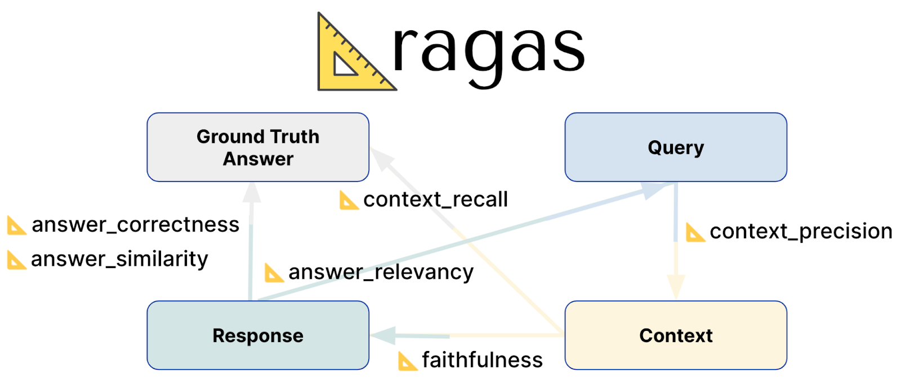
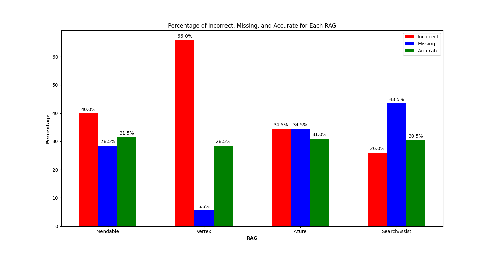
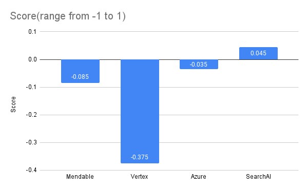
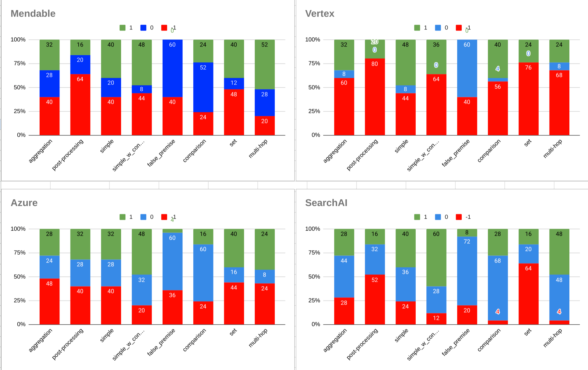
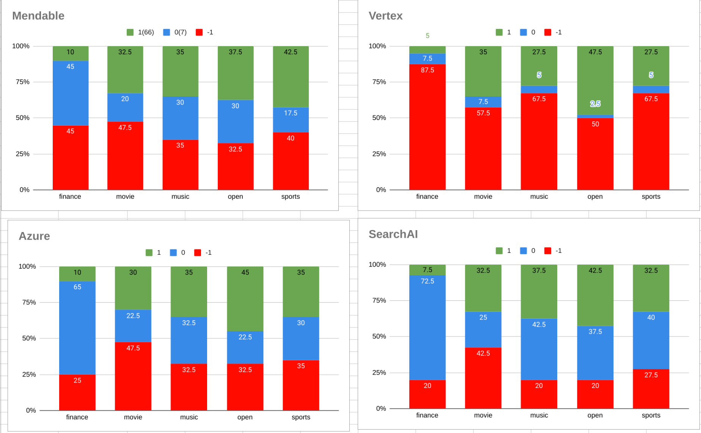
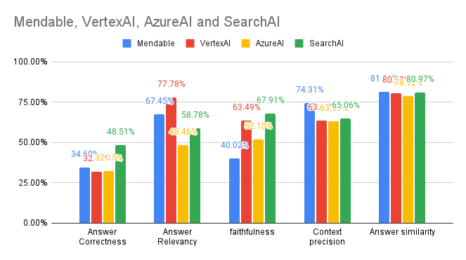

# Benchmarking Enterprise RAG Providers: A Case Study on Azure, Vertex, Mendable, and SearchAI

## Introduction

In the ever-evolving landscape of AI, Retrieval-Augmented Generation (RAG) has emerged as a powerful technique to enhance the accuracy and relevance of generated content. This case study explores the performance of four prominent RAG providers—Azure, Vertex, Mendable, and SearchAI—using robust evaluation frameworks.

### Understanding RAG Evaluation

### What is RAG Evaluation?

RAG evaluation assesses the effectiveness of AI systems that combine retrieval mechanisms with generation capabilities. These systems first retrieve relevant information from a knowledge base and then generate responses based on the retrieved content. The evaluation focuses on two main aspects: the quality of the retrieval and the accuracy of the generated response.

### Evaluation Frameworks Used

In our study, we employed two evaluation frameworks: CRAG and RAGAS.

- **[CRAG](https://arxiv.org/pdf/2406.04744) (Comprehensive Retrieval-Augmented Generation)**:  Comprehensive RAG Benchmark (CRAG), a factual question answering benchmark of 4,409 question-answer pairs and Knowledge Graph (KG) search.CRAG is designed to encapsulate a diverse array of questions across five domains and eight question categories. It reflects varied entity popularity from popular to long-tail, and temporal dynamisms ranging from years to seconds.
###
- **[RAGAS](https://arxiv.org/pdf/2309.15217) (Retrieval-Augmented Generation Accuracy Score)**: Ragas is built on the idea that LLMs can effectively evaluate natural language output. It forms paradigms that overcome the biases of using LLMs as judges directly and provides continuous scores that are explainable and intuitive to understand.

.

### Factors Influencing RAG Performance

The performance of RAG systems is influenced by the retrieval mechanism used, the language model (LLM) employed, and the integration between these components. High-quality retrieval ensures that the most relevant information is available, while an effective LLM generates accurate and coherent responses.

Human evaluation, though insightful, is time-consuming and subjective. Evaluation frameworks like CRAG and RAGAS offer a standardized and scalable approach to assess RAG systems, providing consistent metrics across different scenarios.

In RAG evaluation, a missing answer (no response) is often preferable to an incorrect answer. Incorrect answers can mislead users, while a missing answer maintains the system's integrity and highlights areas for improvement.

### Metrics Used: CRAG and RAGAS

### RAGAS Metrics

1. **Context Precision**: Uses the question and retrieved contexts to measure the signal-to-noise ratio.
2. **Context Recall**: Uses the ground truth and retrieved contexts to check if all relevant information for the answer is retrieved.
3. **Faithfulness**: Uses the contexts and the bot answer to measure if the claims in the answer can be inferred from the context.
4. **Answer Relevancy**: Uses the question and the bot answer to assess whether the answer addresses the question (does not consider factuality but penalizes incomplete or redundant answers).
5. **Answer Correctness**: Uses the ground truth answer and the bot answer to assess the correctness of the bot answer.

### CRAG Metrics

CRAG uses a scoring method to assess the performance of RAG systems based on the following criteria:

1. **Perfect**: The response correctly answers the user’s question and contains no hallucinated content.
2. **Acceptable**: The response provides a useful answer to the user’s question but may contain minor errors that do not harm the usefulness of the answer.
3. **Missing**: The response is “I don’t know”, “I’m sorry I can’t find ...”, a system error such as an empty response, or a request from the system to clarify the original question.
4. **Incorrect**: The response provides wrong or irrelevant information to answer the user’s question.

The scoring method,assigns scores of 1, 0.5, 0, and -1 for perfect, acceptable, missing, and incorrect answers, respectively. For a given RAG system, we compute the average score from all examples in the evaluation set as the final score.

The significance of each metric lies in its ability to pinpoint specific strengths and weaknesses in the RAG system, guiding further improvements.

### Evaluation Data Needed for Ragas and CRAG
Your RAG pipeline evaluation will need four key data points.

**Question:**  The specific query or request made to the RAG system.

**Contexts:** Relevant text chunks from your data that closely match the question's meaning (not required for CRAG evaluation).

**Answer:** Generated answer from your RAG chatbot to the question.

**Ground truth answer:** The expected or correct answer to the question..

## Our Case Study

### Dataset Used: 

We utilized the CRAG dataset, known for its comprehensive coverage across various domains and question types. This dataset is ideal for benchmarking RAG systems due to its diverse nature, which tests the system's robustness and adaptability.
The dataset covers multiple domains, including movies, finance, music,open and sports, ensuring a broad evaluation spectrum. we have 1000 structured data in the dataset
[Download the dataset here](https://drive.google.com/file/d/1Xs-j-GAbNCZQ5_arJomgTBakhA0Rt7Fv/view?usp=drive_link)

We have 200 question that we used for evaluating the RAG Application contains different question types including aggregation, post-processing, simple, simple with condition, false premise,comparison,set and multihop.
[Download the Questions here](https://docs.google.com/spreadsheets/d/1aGgyRpdKjn4_7a2RXwIaeEn053pf4Xf5/edit?usp=drive_link&ouid=104282734582222151911&rtpof=true&sd=true)

### Create and Configure RAG Systems

To set up each RAG provider's application and configure it with specific settings, we followed these steps:
######
**1. Number of Documents Ingested :** We ingested 1000 structured data entries into each RAG application to establish a comprehensive knowledge base.
######
**2.Embedding Model Used :** Default embeddings provided by each respective RAG provider were selected to optimize retrieval performance.
######
**3.LLM Model Used**: We used the GPT-4 LLM model for Azure, Mendable, and SearchAI, aiming to optimize response accuracy. For VertexAI, we opted for the Gemini 1.0 Pro model to achieve similar enhancements in response quality..

### Scripts Used for Evaluation

[Download CRAG Evaluation script](https://drive.google.com/file/d/1CYFRlK-Sh6pxNBNMCaBLfzo1uSQgf66q/view?usp=drive_link)
[Download RAGAS Evaluation script](https://drive.google.com/file/d/1CYFRlK-Sh6pxNBNMCaBLfzo1uSQgf66q/view?usp=drive_link)

### Performance Statistics

#### CRAG Evaluation:

Below are the aggregated results of the CRAG evaluation based on 200 questions:

| Provider           | Perfect (%) | Missing (%) | Incorrect (%) |
|--------------------|-------------|-------------|---------------|
| Mendable           | 31.5        | 28.5        | 40            | 
| Vertex             | 28.5        | 5.5         | 66            | 
| Azure              | 31          | 34.5        | 34.5          |
| SearchAI           | 30.5        | 43.5        | 26            |

***Score of Each RAG Providers***
This CRAG score Ranges from -1 to 1 where -1 refers halucinated results 1 refers to Accurate results
We are calculating score base on below formula

***Formula***: \[
\left( \frac{2 \times \text{n\_correct} + \text{n\_miss}}{\text{n}} \right) - 1
\]

***Significance***: This score combines the number of correct answers (weighted double) and the number of missing answers, normalized by the total number of predictions. It provides an overall performance metric where higher values indicate better performance.

We calculated(In percentages) how each RAG Performs for various Question Types(20 question for each Category)

We also calculated(in percentages) how each RAG performs for various Domains(40 question per Domain)

### Analysis of Results

#### Mendable

- **Perfect Answers**: 31.5%
- **Missing Answers**: 28.5%
- **Incorrect Answers**: 40%

**Strengths**: 
* Mendable had a balanced performance with a reasonable percentage of perfect answers.
* Balanced performance across domains.
* Strong in sports domain and handles simple vs. complex and false premise questions well.

**Weaknesses**: 
* The high rate of incorrect answers indicates significant room for improvement in retrieval and generation accuracy.
* Struggles with post-processing and set questions

#### Vertex

- **Perfect Answers**: 28.5%
- **Missing Answers**: 5.5%
- **Incorrect Answers**: 66%

**Strengths**: 
* Vertex had a low rate of missing answers, suggesting that it attempts to answer most questions.

* Best in open domain with balanced perfect and incorrect answers.

**Weaknesses**:
* The high percentage of incorrect answers highlights the need for better precision in the retrieved information and generated responses.
* Significant challenges in post-processing, set, and multi-hop questions.

#### Azure

- **Perfect Answers**: 31%
- **Missing Answers**: 34.5%
- **Incorrect Answers**: 34.5%

**Strengths**: 
* Azure showed a balanced approach, with a relatively high rate of perfect answers.
* Strong in open domain.

**Weaknesses**: 
* The equal distribution between missing and incorrect answers suggests a need for improved retrieval strategies to reduce errors and avoid unnecessary omissions.
* High rate of missing answers in comparison questions and challenges with multi-hop and aggregation questions.

#### SearchAI 

- **Perfect Answers**: 30.5%
- **Missing Answers**: 43.5%
- **Incorrect Answers**: 26%

**Strengths**: 
* SearchAI  demonstrated a cautious approach, with a high rate of missing answers indicating that it prefers not to provide potentially incorrect information.
* Strong in simple vs. complex and multi-hop questions.
* Low incorrect answers in false premise and comparison questions.

**Weaknesses**: 
* The lower percentage of perfect answers suggests potential for further fine-tuning to enhance accuracy.

* High rate of missing answers in aggregation, false premise, and comparison questions.
* Challenges with set and post-processing questions.

### Key Takeaways
- **Common Strengths:**
  - Mendable, Azure, and SearchAI handle simple vs. complex and false premise questions relatively well.
  - All providers show their best performance in the open domain.

- **Common Weaknesses:**
  - All providers struggle with post-processing and set questions.
  - Finance domain shows significant challenges across all providers.
  - High rates of incorrect or missing answers indicate a need for better retrieval and generation accuracy.

#### RAGAS Evaluation:

## Conclusion
In this comprehensive evaluation of enterprise RAG providers using the CRAG and RAGAS frameworks, we have identified key insights into the performance, strengths, and areas for improvement of these systems.
There is a trade-off between providing correct answers and avoiding incorrect ones. Some providers adopt a cautious approach, leading to higher rates of missing answers but fewer incorrect responses. Others attempt to answer most questions, resulting in lower missing rates but higher incorrect answers.
This case study highlights the importance of continuous improvement in RAG systems. By addressing the identified weaknesses and building on their strengths, providers can enhance their performance and reliability. The use of comprehensive evaluation frameworks like CRAG and RAGAS is crucial in guiding these improvements, helping to advance AI-powered retrieval and generation technologies for more accurate and relevant responses in various applications.