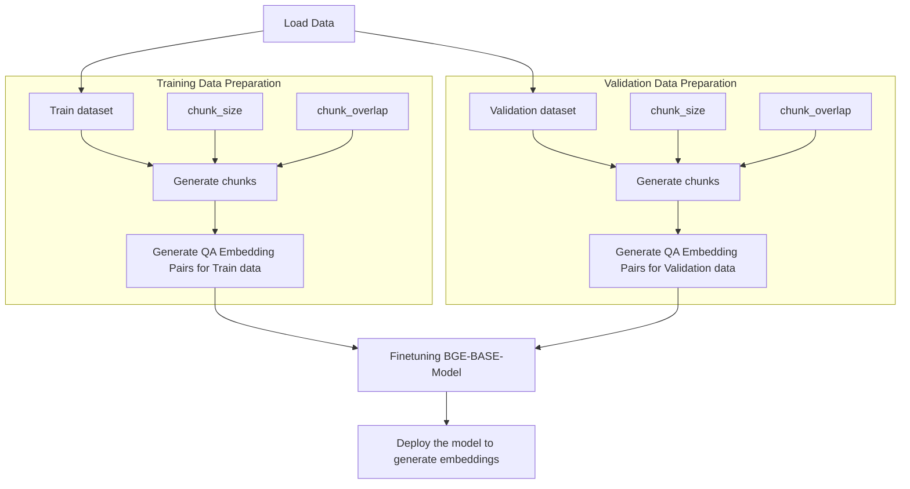

# Unlocking the Power of Embeddings: A Deep Dive into Fine-Tuning Embedding Models 

In the rapidly evolving field of information retrieval and text generation, embedding models have become foundational tools. These models transform text into dense vectors of numbers, capturing semantic meanings in ways that machines can understand. While pre-trained embedding models like Word2Vec, GloVe, and BERT have revolutionized various tasks, fine-tuning these models for specific applications, such as Retrieval-Augmented Generation (RAG), can significantly enhance their performance. In this blog, we'll delve into why fine-tuning embedding models for RAG systems is important, the advantages it offers, and the working principles behind it.

## Introduction to Embedding Models for RAG

Embedding models are essential in RAG systems for converting text into numerical representations that capture semantic relationships. These representations, known as embeddings, allow machines to process and understand language more effectively, making them crucial for retrieving relevant information and generating coherent text. Pre-trained embedding models have been trained on vast corpora of text, providing a robust foundation for various applications, but fine-tuning can tailor these models to specific RAG tasks, enhancing their efficiency and accuracy.

## Importance of Embeddings in RAG Systems

Embedding models are the backbone of RAG systems, providing the numerical representations that enable machines to process and understand language. Here's how embedding models empower RAG systems:


- **Enhanced Information Retrieval:** Embedding models transform queries and documents into dense vector representations, capturing semantic similarities. In RAG systems, these vectors are stored in vector databases, allowing for efficient retrieval of the most relevant documents or text passages based on the input query. This process significantly improves the accuracy and relevance of the retrieved information.

- **Contextual Understanding:** By capturing the semantic relationships between words and phrases, embeddings help RAG systems understand the context of queries and documents. This contextual understanding is crucial for generating coherent and contextually appropriate responses in various applications, such as customer support or virtual assistants.

- **Content Generation:** Embedding models play a key role in generating new text content by providing a deep understanding of the semantic relationships within the input data. This capability is essential for tasks like summarization, report generation, and creative writing, where the system needs to produce coherent and contextually relevant text. Vector databases help quickly find and utilize the most relevant content to base these generations on.


Pre-trained embedding models provide a strong foundation for these tasks, but fine-tuning can tailor them to specific domains and improve performance by adapting the models to capture domain-specific language patterns and nuances.


## Why Fine-Tune an Embedding Model for RAG?

Pre-trained embedding models are trained on large, general-purpose datasets and can be highly effective for a wide range of tasks. However, they might not always capture the nuances required for specialized applications in RAG systems. Fine-tuning involves taking a pre-trained model and adapting it to a specific dataset or task, allowing it to learn domain-specific language patterns and improve its performance.

- **Domain-Specific Vocabulary:** Pre-trained models may not fully understand the specific terminology or jargon used in specialized fields like medicine, law, or finance. Fine-tuning helps the model grasp these unique vocabularies better.
  
- **Improved Accuracy:** Fine-tuning can lead to better performance on specific RAG tasks, such as information retrieval or question answering, by adapting the model to the peculiarities of the target data.
  
- **Efficiency:** Instead of training a model from scratch, which requires significant computational resources and time, fine-tuning leverages the existing knowledge of pre-trained models and adapts it relatively quickly.

### Workflow of Fine-Tuning Embedding Models

<!-- Fine-tuning embedding models involves several key steps and principles: -->



#### 1. Load Data

The initial step involves loading PDF documents, which are then split into training and validation datasets based on a specified split ratio. This process ensures that we have distinct datasets for training the model and evaluating its performance. The final outcome is well-prepared **Training Data** and **Validation Data**.

#### 2. Generate Chunks

Handling long documents can be challenging, so we break them down into manageable chunks. This chunking process ensures that each segment retains coherent and contextually rich information, which is essential for generating meaningful questions. By default, our chunking parameters are set to:
- **Chunk Size:** 1024 tokens
- **Chunk Overlap:** 200 tokens

These parameters can be adjusted as needed to optimize performance.
#### 3. Generating QA Embedding Pairs

Once the chunks are prepared, they are used to generate QA embedding pairs. This step involves creating a structured dataset containing (queries, corpus, relevant docs) pairs using an OpenAI LLM. This structured dataset helps in fine-tuning the embedding model by pairing questions with their corresponding chunks. This approach enhances retrieval capabilities by focusing on relevant information.

#### 4. Fine-Tuning the Embedding Model with Custom Dataset

For fine-tuning the embedding model, we use the `SentenceTransformersFinetuneEngine()` function from llama-index. This function takes several parameters:
- **Training QA-Embedding Pairs**
- **Validation QA-Embedding Pairs**
- **Model ID (Hugging Face Model Id)**
- **Output Folder Path**
- **Batch Size**
- **Epochs**

These parameters guide the fine-tuning process to tailor the embedding model to our specific dataset, improving its performance and accuracy.

**NOTE: The fine-tuning embedding utility we build is used to fine-tune any embedding models from Hugging Face directly using custom datasets based in the model id.**

#### 5. Deploy the Model to Generate Embeddings

The final step involves deploying the finetuned model. A Python service is created to use the finetuned embedding model for generating embeddings from given texts. This deployment ensures that the model is ready for real-world applications and can generate accurate embeddings for various text inputs.
- **Sample usage of the finetuned embedding model**
```python
from sentence_transformers import SentenceTransformer
sentences = ["This is an example sentence", "Each sentence is converted"]

model = SentenceTransformer('{FINETUNED_MODEL_PATH}')
embeddings = model.encode(sentences)
print(embeddings)
```
<!-- ### Pros of Fine-Tuning Embedding Models

1. **Enhanced Performance**: Fine-tuning can significantly improve the accuracy and relevance of embeddings for specific tasks, making the model more effective in real-world applications.

2. **Resource Efficiency**: Leveraging pre-trained models saves computational resources. Fine-tuning requires less data and training time compared to training a model from scratch.

3. **Flexibility**: Fine-tuning allows for customization according to specific needs, enabling the model to adapt to various contexts and domains. -->

## Evaluating the Embedding Model

In our recent experiment, we fine-tuned the BAAI/bge-base-en embedding model using a e-commerce dataset. This fine-tuning process yielded significant improvements in retrieval performance, demonstrating the benefits of domain-specific model adaptation.

### Performance Gains

- **Chunk Recall Improvement:** The fine-tuned model achieved over a 13% improvement in chunk recall compared to the sentence-transformers/multi-qa-mpnet-base-cos-v1 model.
- **Enhanced Retrieval Accuracy:** When benchmarked against the top-performing pre-trained model (BAAI/bge-base-en), the fine-tuned model showed a 7% increase in retrieval accuracy.

These enhancements underscore the value of customizing embedding models to specific domains and datasets. Even when starting with high-quality pre-trained models, domain-specific fine-tuning can lead to notable performance gains, ensuring more accurate and relevant information retrieval in specialized applications. 

## Utilizing Our Fine-Tuning Embedding Utility

We have developed a comprehensive utility to streamline the fine-tuning process for embedding models. This utility simplifies the workflow, allowing you to effortlessly prepare your data, generate chunks, and create QA embedding pairs for fine-tuning.


### Get Started

To start using our fine-tuning utility, follow the installation setup and run your first fine-tuning script as described here: [Setup & Running First Fine-tuning Script](https://github.com/Koredotcom/SearchAssist-Toolkit/tree/master/Utilities/FineTune%20Embeddings).

This utility is designed to make the fine-tuning process accessible and efficient, empowering you to enhance your embedding models for specialized applications with ease.

## Conclusion
In conclusion, fine-tuning embedding models for Retrieval-Augmented Generation (RAG) is a crucial process for enhancing model performance and retrieval accuracy. By carefully preparing training and validation data, generating meaningful chunks, and creating QA embedding pairs, we set a solid foundation for the model to learn from contextually rich information. This workflow not only streamlines the training process but also significantly improves the effectiveness of embedding models in real-world scenarios. As we continue to refine these techniques, we can expect even greater advancements in retrieval and generation capabilities, paving the way for more intelligent and responsive AI systems.


