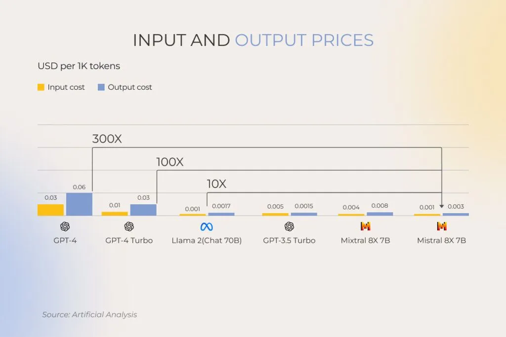
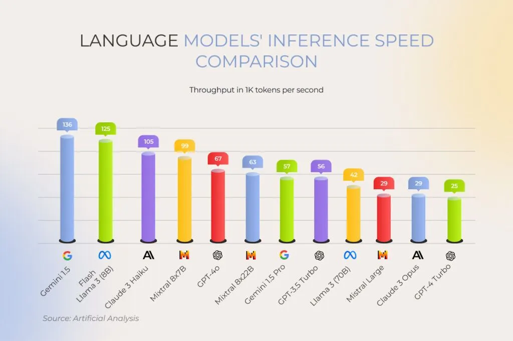
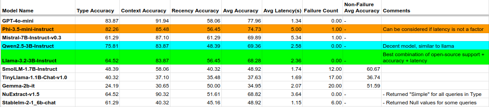
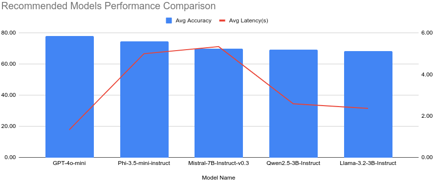
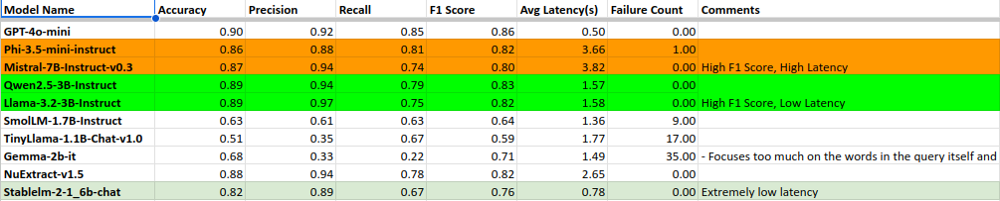
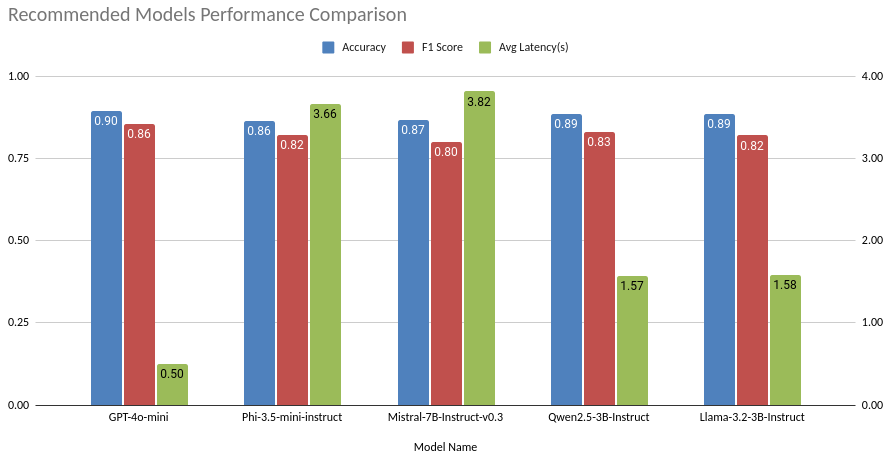
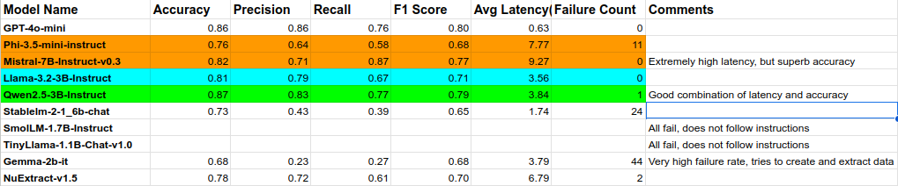
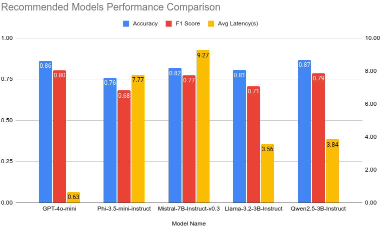
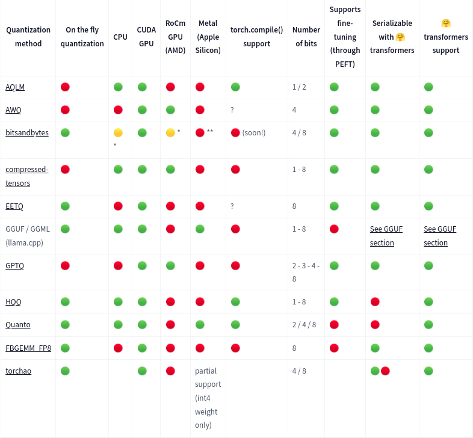
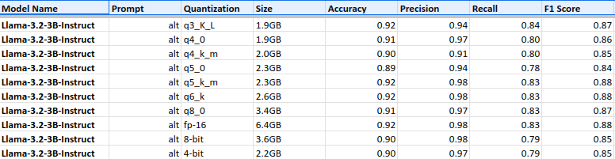

# Small But Mighty: Supercharging RAG Systems with Small Language Models

*Author: [Vikhyath Venkatraman](https://github.com/Vikhyath-Kore)*

- [Small But Mighty: Supercharging RAG Systems with Small Language Models](#small-but-mighty-supercharging-rag-systems-with-small-language-models)
  - [Introduction](#introduction)
    - [Background](#background)
      - [SearchAI Application](#searchai-application)
      - [Challenges with Traditional Search Approaches in the era of RAG](#challenges-with-traditional-search-approaches-in-the-era-of-rag)
    - [Problem Statement](#problem-statement)
  - [Small Language Models: The Game Changer](#small-language-models-the-game-changer)
    - [How Big is a Small Language Model?](#how-big-is-a-small-language-model)
    - [SLMs vs LLMs](#slms-vs-llms)
    - [Direct Comparison](#direct-comparison)
      - [Cost](#cost)
      - [Inference Time](#inference-time)
    - [SLM Selection Criteria](#slm-selection-criteria)
  - [Model Comparison](#model-comparison)
    - [Use Case Analysis](#use-case-analysis)
    - [Performance Metrics](#performance-metrics)
    - [Dataset for Evaluation](#dataset-for-evaluation)
  - [Implementation Strategy](#implementation-strategy)
    - [Implementation Parameters](#implementation-parameters)
    - [Implementation Results](#implementation-results)
      - [User Query Classification](#user-query-classification)
      - [User Query Source Identification](#user-query-source-identification)
      - [User Query Metadata Identification and Mapping](#user-query-metadata-identification-and-mapping)
    - [Implementation Inferences](#implementation-inferences)
  - [Business Impact](#business-impact)
    - [Cost Savings](#cost-savings)
    - [Relative Performance Constancy](#relative-performance-constancy)
    - [Scalability Advantages](#scalability-advantages)
  - [Future Roadmap](#future-roadmap)
  - [Conclusion](#conclusion)
  - [Appendix: Quantization of SLMs](#appendix-quantization-of-slms)
    - [Introduction](#introduction-1)
    - [Types](#types)
    - [Performance](#performance)
    - [Conclusion](#conclusion-1)

## Introduction

### Background

#### SearchAI Application
SearchAI is a versatile conversational search platform that enables seamless content discovery across various data sources, including website crawlers, structured and unstructured documents, catalogs, FAQs, and knowledge bases. It features pre-built integrations with popular commerce and content platforms, ensuring automatic synchronization and document access control. Additionally, SearchAI supports federated search capabilities, allowing you to leverage results from existing business systems. With intelligent virtual assistant actions, AI-powered relevance optimization, and a customizable user interface, it creates a personalized and engaging search experience that drives brand engagement and conversions.

#### Challenges with Traditional Search Approaches in the era of RAG

- **Limited Contextual Understanding**: Often relies on keyword matching, missing user intent and context.
- **Static Results**: Provides unchanging search results that don’t adapt to user needs.
- **Data Fragmentation**: Struggles to integrate and retrieve information from diverse sources.
- **Poor User Engagement**: Lacks interactivity and personalization, reducing user effectiveness.
- **Inefficient Ranking**: May not rank results effectively based on relevance or behavior.
- **Scalability Issues**: Can become slow and inefficient as data volume grows.
- **Inability to Learn**: Often doesn't learn from user interactions, missing improvement opportunities.

### Problem Statement

In the same vein, there are many challenges to the use of RAG:

- **Data Quality Dependence**: Relies on the quality and relevance of retrieved data.
- **Integration Complexity**: Difficult to implement with seamless retrieval and generative models.
- **Contextual Overload**: Excessive context can overwhelm the model, leading to incoherence.
- **Latency Issues**: Retrieval processes may slow down response times.
- **Scalability Challenges**: Growing data volumes can hinder efficiency.
- **Bias and Misinformation**: Risk of amplifying biases or generating false information.
- **Lack of Interpretability**: Outputs can be opaque, making decision processes unclear.
- **Resource Intensity**: High computational and storage demands may limit feasibility.

Many of these issues can be addressed by using an LLM (Large Language Model)-generated execution plan, which takes the user query, rephrases it, and performs SQL-like retrieval for any user query, regardless of the source. However, generating such an execution plan involves multiple LLM calls, leading to significant cost implications. Therefore, there is a need to identify a cost-effective middle ground that provides high-quality language model responses.

## Small Language Models: The Game Changer

### How Big is a Small Language Model?

While there is no strict definition, Small Language Models (SLMs) are generally considered to be at least an order of magnitude smaller than their larger counterparts, LLMs. For this use case, we define SLMs as having between 2 billion and 7 billion parameters.

### SLMs vs LLMs

1. **Size**: LLMs, like Claude 3 and Olympus, can have up to 2 trillion parameters, while SLMs, such as Phi-2, typically have around 2.7 billion.
2. **Training Data**: LLMs require extensive and diverse datasets for broad learning, whereas SLMs focus on specialized, smaller datasets.
3. **Training Time**: Training an LLM can take months, while SLMs can be trained in just weeks.
4. **Computing Power and Resources**: LLMs demand significant computational resources due to their size and data requirements, making them less sustainable compared to SLMs, which require fewer resources.
5. **Proficiency**: LLMs excel at complex and general tasks, while SLMs are better suited for simpler, more specific tasks.
6. **Adaptation**: Adapting LLMs to customized tasks can be challenging and resource-intensive, whereas SLMs are easier to fine-tune for specific needs.
7. **Inference**: LLMs need specialized hardware and cloud services for inference, limiting their use to online environments. In contrast, SLMs can run locally on devices like Raspberry Pi or smartphones, allowing offline functionality.
8. **Latency**: LLMs often face significant latency, with response times of several seconds, while SLMs typically offer much faster responses due to their smaller size.
9. **Cost**: Higher computational demands and larger model sizes make LLMs more expensive to operate, whereas SLMs are generally cheaper to run.
10. **Control**: With LLMs, you rely on the model builders, which can lead to issues like model drift. SLMs can be run on personal servers, allowing users to fine-tune and stabilize them over time.

### Direct Comparison

#### Cost

If we use the most popular LLM, GPT-4o, the cost of inference, via API calls, is (as of October 2024) is [$2.5 per 1M input tokens and $1.25 per 1M output tokens](https://openai.com/api/pricing/).

In contrast, Mistral-7b, via Mistral's own API, is [$0.25 per 1M input tokens and $0.25 per 1M output tokens](https://mistral.ai/technology/). Even GPT-4o-mini, which is rumored to have around 8b tokens, costs around [$0.15 per 1M input tokens and $0.075 per 1M output tokens](https://openai.com/api/pricing/).

This means that for a company with 300 employees, making 5 modest 1k token sized requests per day would add up to around $300 a month, while using Mistral would only cost around $30 a month, for 10x savings.

[Image Source](https://www.instinctools.com/blog/llm-vs-slm/)

#### Inference Time

LLMs’ power as a one-size-fits-all solution comes with performance trade-offs. Large models are times slower than their smaller counterparts because the whole multi-billion model activates every time to generate the response.

[Image Source](https://www.instinctools.com/blog/llm-vs-slm/)

### SLM Selection Criteria

The SLM Models selected were as follows:
- [OpenAI’s GPT-4o-mini (API)](https://openai.com/index/gpt-4o-mini-advancing-cost-efficient-intelligence/)
- [MistralAI’s Mistral-7B-v0.3](https://huggingface.co/mistralai/Mistral-7B-v0.3)
- [Microsoft’s Phi-3.5-mini-instruct](https://huggingface.co/microsoft/Phi-3.5-mini-instruct)
- [Meta Research’s Llama-3.2-3B-Instruct](https://huggingface.co/meta-llama/Llama-3.2-3B-Instruct)
- [Alibaba’s Qwen 2.5-3B-instruct](https://huggingface.co/Qwen/Qwen2.5-3B-Instruct)
- [StableLM’s Stable LM 2 1.6B](https://huggingface.co/stabilityai/stablelm-2-1_6b)
- [Huggingface’s SmolLM-1.7B-Instruct](https://huggingface.co/TinyLlama/TinyLlama-1.1B-Chat-v1.0)
- [TinyLlama’s TinyLlama-1.1B-Chat-v1.0](https://huggingface.co/TinyLlama/TinyLlama-1.1B-Chat-v1.0)
- [Numind’s NuExtract-v1.5](https://huggingface.co/numind/NuExtract-v1.5)
- [Google’s Gemma-2-2b-it](https://huggingface.co/google/gemma-2-2b-it)

The SLMs were selected on the basis of multiple criteria, such as:
- **Size and Complexity**: Balance model size with performance and resource needs.
- **Instruct Models**: Instruct models were considered over base models as they are better at following instructions without any further pre-training, and they are optimized for the [chat template](https://huggingface.co/docs/transformers/main/en/chat_templating).
- **Hugging Face Stars/Popularity**: Higher star ratings indicate trust and usage.
- **Support and Documentation**: Ensure good documentation and active support.
- **Ease of Fine-tuning**: Select models that allow quick fine-tuning.
- **Deployment Options**: Check for flexible deployment (local, cloud, hybrid).
- **Deployment Date**: Consider the model's release date for relevance.
- **Open Source**: Verify if the model is open source for flexibility and community contributions.
- **Licensing**: Review the licensing terms to ensure compliance with your usage requirements and any restrictions.

## Model Comparison

### Use Case Analysis

We wanted to replace LLM calls with SLM calls for three major use-cases:
1. **User Query Classification**: Classify the query based on its type, context and recency. 
2. **User Query Source Identification**: From a given list of sources, identify one or more sources that are required to answer the query.
3. **User Query Metadata Identification and Mapping**: From the list of all the metadata fields of a particular source, identify which fields are required to answer the query.

These tasks were especially suited to SLM replacements as these tasks
- Are highly **specific**, aligning with SLMs' design for targeted tasks.
- **Require minimal prior knowledge**, as all necessary information is contained within the query.
- **Do not need a large context window**, as larger context can negatively impact performance in smaller models.

### Performance Metrics

The following metrics were analyzed to evaluate the most optimal SLM for each use case:

1. **User Query Classification**
    - Type Accuracy
    - Context Accuracy
    - Recency Accuracy
    - Average Accuracy
    - Average Latency
    - Failure Count
2. **User Query Source Identification**
    - Accuracy
    - Precision
    - Recall
    - F1 Score
    - Average Latency
    - Failure Count
3. **User Query Metadata Identification and Mapping**
    - Accuracy
    - Precision
    - Recall
    - F1 Score
    - Average Latency
    - Failure Count

### Dataset for Evaluation

The evaluation dataset was synthetically generated with the assistance of ChatGPT and a few manually crafted examples. The distribution of examples was as follows:

- **User Query Classification**: 63 queries
- **User Query Source Identification**: 77 queries + possible_sources
- **User Query Metadata Identification and Mapping**: 77 queries from 3 sources with around 10 fields in each source

## Implementation Strategy

### Implementation Parameters

1. All models were sourced from Hugging Face and used default parameters.
2. Output tokens were capped at 50 for all use cases to mitigate hallucinations.
3. Models were executed in Colab.
4. Minimal post-processing of data was performed, saving only the first JSON outcome.

### Implementation Results

#### User Query Classification

#### User Query Source Identification

#### User Query Metadata Identification and Mapping

### Implementation Inferences

1. For the first two use cases, Llama-3.2-3B-Instruct outperformed the other models, while Qwen2.5-3B-Instruct excelled in the third use case.
2. Although Phi-3.5-mini-instruct and Mistral-7B-Instruct-v0.3 showed good accuracy, they exhibited relatively higher latency.

## Business Impact

### Cost Savings

As previously mentioned, using SLMs can yield up to tenfold savings in API call costs, along with lower latency. SLMs do not necessitate high-end GPUs for hosting and can provide reasonable results on low-end machines.

### Relative Performance Constancy

As demonstrated, even without further fine-tuning, SLMs can achieve 80-90% accuracy using synthetic data. SLMs' popularity stems largely from their ease of fine-tuning, which will likely enhance accuracy even further.

### Scalability Advantages

SLMs offer notable scalability benefits over LLMs, thanks to their lower resource requirements and faster deployment times, making them cost-effective for large-scale applications. They allow for quicker updates and fine-tuning, enabling agile responses to changing needs. Additionally, SLMs improve latency and simplify management, enhancing user experience and operational efficiency.

## Future Roadmap

1. Utilizing fine-tuned SLMs instead of merely instruct models will undoubtedly enhance performance for specific use cases.
2. Addressing further use cases, such as dynamically determining the number of chunks needed for LLMs based on user queries or formatting responses according to user needs (retrieval vs. summary vs. insights, etc.).
3. Implementing performance optimization techniques during deployment, such as quantization.
4. Adopting standard practices for model deployments, including:
    - Shadow evaluation
    - A/B testing
    - Multi-arm bandits
5. Continuous testing will be crucial as newer LLMs are released, necessitating regular updates to the pipeline.

## Conclusion

The exploration of Small Language Models (SLMs) as a cost-effective and efficient alternative to Large Language Models (LLMs) presents a compelling case for their integration into Retrieval-Augmented Generation (RAG) systems. By addressing key challenges such as scalability, latency, and resource requirements, SLMs can enhance performance and user experience in various applications. The analysis shows that SLMs not only deliver significant cost savings—up to tenfold compared to LLMs—but also maintain impressive accuracy levels, making them particularly well-suited for specific tasks.

As organizations continue to seek agile and adaptable solutions in a rapidly evolving digital landscape, SLMs provide a promising pathway forward. The ability to fine-tune these models for specialized applications further amplifies their potential, ensuring they can meet diverse user needs effectively. Looking ahead, the integration of advanced deployment strategies and ongoing testing will be crucial to harnessing the full capabilities of SLMs. Ultimately, leveraging these smaller models can supercharge RAG systems, driving innovation and improving content discovery while remaining mindful of operational efficiencies.

## Appendix: Quantization of SLMs

### Introduction

Quantization techniques aim to reduce data representation while preserving accuracy. This often involves converting data types to represent the same information with fewer bits. For instance, changing model weights from 32-bit floating points to 16-bit floating points halves the model size, easing storage and reducing memory usage. Additionally, lower precision can accelerate inference times since calculations require less computational power.

### Types

These are the types of quantization supported on Huggingface.

The more popular of the types of quantization are:

1. [GGUF/GGML](https://github.com/ggerganov/ggml): This tensor library enables high-performance machine learning on standard hardware. Named after its creator Georgi Gerganov, GGML includes low-level primitives and a binary format for distributing large language models (LLMs). You can find supported types for llama.cpp on Hugging Face here.
2. [bitsandbytes](https://github.com/TimDettmers/bitsandbytes): This tool simplifies the quantization of models to 8 and 4 bits. The 8-bit quantization method multiplies outlier values in fp16 with non-outlier int8 values, converting them back to fp16 to minimize performance degradation. The 4-bit option compresses models further and is often used with QLoRA for fine-tuning quantized LLMs.
3. [AWQ](https://huggingface.co/docs/transformers/main/en/quantization/awq): Activation-aware Weight Quantization (AWQ) selectively quantizes model weights, preserving a small subset crucial for performance. This approach significantly reduces quantization loss, allowing models to operate in 4-bit precision without performance loss.

### Performance

In the analysis, the User Query Source Identification use case was tested across various quantized versions of llama to assess performance impacts. Although the full fp-16 model yielded consistently superior results, the performance drop with smaller quantized models was minimal. This indicates that quantized models can maintain nearly equivalent performance for these use cases, ultimately saving time and computational resources.

### Conclusion

Quantization techniques represent a powerful strategy for optimizing Small Language Models (SLMs) while minimizing performance loss. By reducing the precision of model weights, quantization not only decreases storage requirements but also enhances inference speed, making SLMs more efficient and accessible for a variety of applications. The analysis of different quantization methods—such as GGUF/GGML, bitsandbytes, and AWQ—demonstrates their effectiveness in maintaining performance levels even with reduced model sizes.

The results from the User Query Source Identification use case highlight that quantized models can operate almost as effectively as their full-precision counterparts, offering a compelling case for their adoption in resource-constrained environments. As organizations continue to seek agile, cost-effective solutions for their AI needs, leveraging quantization in SLMs will be crucial for achieving operational efficiency and scalability without sacrificing accuracy. This approach not only aligns with the growing demand for sustainable AI practices but also opens the door to faster and more efficient deployment of intelligent systems across various domains.