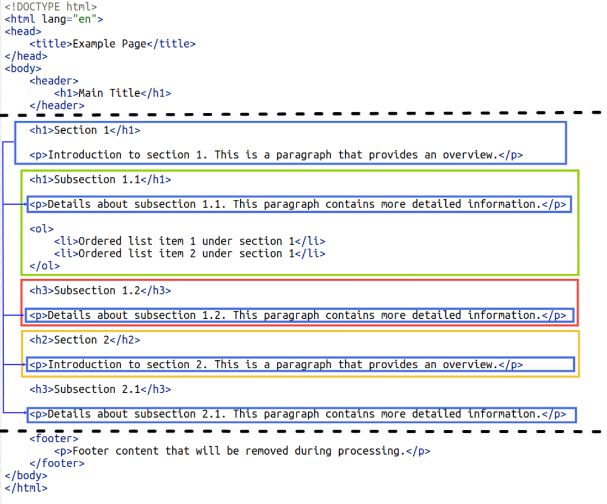
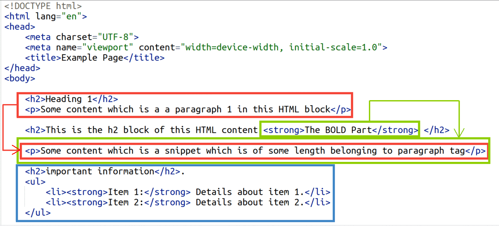

# Extractive Snippets: Understanding the HTML Structure for Optimal Extraction

## Overview

In this guide, we will explain how our extractor processes HTML content to generate extractive snippets. By understanding the required HTML structure, you can optimize your content for better extraction results.

## How the Extractor Works

Our extractor removes all headers and footers from the HTML content. The extraction process follows a systematic approach to create meaningful chunks of content. Here's a step-by-step breakdown of how it works:

### Step 1: Initial Chunk Creation

1. **Title Extraction**: The extractor first identifies the title of the HTML document and creates the initial chunk with this title.
2. **Paragraph Tags**: Following the title, the extractor consolidates all `<p>` (paragraph) tags present in the entire HTML document into a single, large chunk.

### Step 2: Subsequent Chunk Creation

From the second chunk onwards, the extractor processes the HTML content based on header tags. Here's the detailed process:

1. **Header Tags**: The extractor identifies all header tags (e.g., `<h1>`, `<h2>`, `<h3>`, etc.).
2. **Content Under Headers**: For each header tag, the extractor collects the content (paragraph tags `<p>` and span tags `<span>`) immediately following it to form a chunk.
3. **New Header Detection**: The process continues until another header tag is encountered. At this point, the extractor creates a new chunk with the new header and its associated content.
4. **Special Case Handling**: If a header tag contains a `<strong>` or `<span>` tag, the content of these tags will be used as the header instead of the header tag itself.

This method ensures that each chunk is contextually meaningful, with headers acting as separators and paragraph or span content providing detailed information under each header.

## Example HTML Structure

### Standard HTML Example

To illustrate the standard process, let's consider an example HTML structure:

```html
<!DOCTYPE html>
<html>
<head>
    <title>Sample Document</title>
</head>
<body>
    <header>
        <h1>Main Title</h1>
    </header>

    <h1>Section 1</h1>
    <p>Introduction to section 1. This is a paragraph that provides an overview.</p>
 
    <h1>Subsection 1.1</h1>
    <p>Details about subsection 1.1. This paragraph contains more detailed information.</p>
    <ol>
        <li>Ordered list item 1 under section 1</li>
        <li>Ordered list item 2 under section 1</li>
    </ol>
   
    <h3>Subsection 1.2</h3>
    <p>Details about subsection 1.2. This paragraph contains more detailed information.</p>

    <h2>Section 2</h2>
    <p>Introduction to section 2. This is a paragraph that provides an overview.</p>
    <ol>
        <li>Ordered list item 1 under section 2</li>
        <li>Ordered list item 2 under section 2</li>
    </ol>

    <h3>Subsection 2.1</h3>
    <p>Details about subsection 2.1. This paragraph contains more detailed information.</p>

    <footer>
        <p>Footer content that will be removed during processing.</p>
    </footer>
</body>
</html>
```
### Chunk Extraction for above HTML



## HTML Example with strong tag in headings

```<!DOCTYPE html>
<html lang="en">
<head>
    <meta charset="UTF-8">
    <meta name="viewport" content="width=device-width, initial-scale=1.0">
    <title>Example Page</title>
</head>
<body>
    <h2>Heading 1</h2>
    <p>Some content which is a a paragraph 1 in this HTML block</p>
    <h2>This is the h2 block of this HTML content <strong>The BOLD Part</strong> </h2>
    <p>Some content which is a snippet which is of some length belonging to paragraph tag</p>
    <h2>important information</h2>.
    <ul>
        <li><strong>Item 1:</strong> Details about item 1.</li>
        <li><strong>Item 2:</strong> Details about item 2.</li>
    </ul>
</body>
</html>
```

### Chunk Extraction for above HTML



