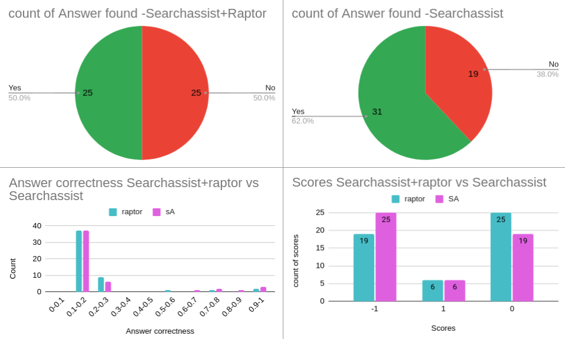

# Understanding RAPTOR:Revolutionizing Retrieval-Augmented Generation with Hierarchical Systems

## Introduction to RAPTOR

RAPTOR introduces a novel approach to improve retrieval-augmented large language models (LLMs) by constructing a hierarchical retrieval system. This system employs **recursive embedding**, **clustering**, and **summarizing** of text chunks, forming a tree structure that captures both high-level summaries and detailed content. This method significantly enhances the model's ability to handle complex, multi-step reasoning tasks and thematic questions by providing context at varying levels of abstraction.

## Working Principle of RAPTOR

RAPTOR's working principle revolves around creating a hierarchical tree structure that organizes information through recursive processes.

### 1. Creating List of Chunks

- Each document is segmented into contiguous text chunks.
- Embeddings are created for the given text chunks .

### 2. Clustering Algorithm

- Clustering algorithm is applied to group the text chunks.
  - Gaussian Mixture Models (GMMs) with UMAP for dimensionality reduction are used.
  - Soft clustering is employed, allowing text chunks to belong to multiple clusters .

### 3. Summarization

- The clustered chunks are summarized to form a new layer of nodes.
  - A language model creates summaries of the grouped texts.
  - These summaries become the parent nodes for the next layer.

### 4. Node Structure

- Each node in the hierarchy contains:
  - Indexes of the child nodes (original text chunks).
  - Summaries of the child nodes.
  - Embeddings of the summarized text.

### 5. Recursive Process

- The process of embedding, clustering, and summarizing nodes is repeated recursively.
- Higher layers of abstraction are formed through this recursive process.
- This process continues until further clustering becomes infeasible.

## Querying Mechanisms in RAPTOR

RAPTOR employs two querying mechanisms to retrieve relevant information from its hierarchical tree structure: **tree traversal** and **collapsed tree**. 

### Tree Traversal Method

1. **Start at the Root Layer**:
   - Compute cosine similarity between the query embedding and root node embeddings.
   - Select the top-k nodes with the highest similarity scores in the root layer of the tree.

2. **Proceed to Child Nodes**:
   - Move to its child nodes and compute cosine similarity and select the top-k child nodes.

3. **Repeat Recursively**:
   - Continue this process for all layers.
4. **Assemble Relevant Context**:
   - Finally, get all the selected node from every layer to assemble the relevant context for the query and this contexts could be sent to LLM for answer generation.

### Collapsed Tree Method

1. **Collapse the Tree**:
   - Flatten the entire RAPTOR tree into a single layer, that includes nodes from every layer of the original tree.

2. **Compute Cosine Similarity**:
   - Calculate cosine similarity between the query embedding and node embeddings for all flattened nodes.

3. **Select Top-k Nodes**:
   - Pick the top-k nodes with the highest similarity scores.

### Evaluating RAPTOR

To evaluate RAPTOR, CRAG dataset containing 50 financial questions was used along with ground truth for each question. For each questions 5 webpage content is taken as a search assist structured data.This evaluation experiment mainly used to compare the performance of a search assist application both with and without RAPTOR's capabilities.

<!--  -->

1. **Data Ingestion and Preparation**: CRAG finance data is ingested into the initial search assist application (App 1) to prepare it for training.

2. **Training and Baseline Evaluation**: App 1 is trained with structured CRAG data and evaluated using RAGAS and CRAG metrics to establish baseline performance.

3. **Text Chunk Extraction from App1**: Relevant data chunks processed by App 1 are extracted for further analysis.

4. **RAPTOR Integration**: Extracted data chunks are used to train RAPTOR, which organizes and summarizes data into a multi-layered structure for efficient retrieval.

5. **Training Raptor's Structured data**: RAPTOR-structured data is ingested and trained into a new search assist application (App 2).

6. **Performance Comparison**: App 2 is evaluated using RAGAS and CRAG metrics to compare its performance directly with App 1, showcasing improvements in accuracy and retrieval efficiency due to RAPTOR.

Finally, the searchassist produces about **5935** text chunks. When this **5935** text chunk are given to RAPTOR, it produces about **6012** text chunks as the final output. Basically Raptor algorithm additionally produces about **77** summarized chunks.

## Evaluation Results

From the above results searchassist provides more answers than Searchassist+Raptor:
- Searchassist: 62% success rate (31/50)
- Searchassist+Raptor: 50% success rate (25/50)

But when we analyze the score metrics, we can clearly see that searchassist+raptor improves overall performance by shifting some incorrect(-1) to missing answers(0), without affecting the number of correct answers.
- Correct answers(1): Both systems have 6 (12%)
- Missing answers (0): Raptor 25 (50%) vs SA 19 (38%)
- Incorrect answers(-1): Raptor 19 (38%) vs SA 25 (50%)

While Searchassist alone finds more answers but it produces more false positives(hallucination).While the addition of Raptor leads to fewer answers found but potentially higher quality when answers are provided.

Finally to check how the two system perform with various questions types, we used the *77* summarized chunk from the RAPTOR to generate 24 questions. we have generated the 24 questions in a such way that each 3 questions categorized per questions types given below:
  - **Aggregation Questions**
  - **Post-processing-heavy Questions**
  - **Simple Questions**
  - **Simple with Condition Questions**
  - **False Premise Questions**
  - **Comparison Questions**
  - **Set Questions**
  - **Multi-hop Questions**

  From the above represented result, we can clearly see that SA+Raptor excels in Aggregation and False Premise questions and SA performs better in Multi-hop questions.Regarding the Answer found metrics, we observed the same insight that we have seen in the previous experiment (ie. searchassist+raptor improves overall performance by shifting some incorrect(-1) to missing answers(0))

## Conclusion
The two experiments conducted on Searchassist (SA) and Searchassist+Raptor (SA+Raptor) systems reveal important insights into their respective strengths and limitations:

- **Answer Discovery:** SA consistently demonstrates a higher answer discovery rate across both experiments, suggesting its strength in finding potential answers.

- **Answer Quality:** SA+Raptor shows a tendency to improve answer quality by reducing definitive errors to neutral outcomes, particularly evident in the second experiment.

- **Question Type Performance:** SA+Raptor excels in specific question types like Aggregation and False Premise questions, while SA performs better on Multi-hop questions.

  

  

