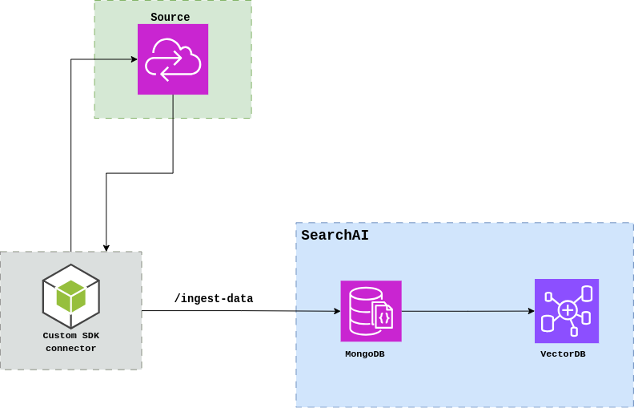

# Custom SDK Connector for SearchAI
## Overview
The Custom SDK Connector is a flexible integration tool that enables seamless data ingestion from various sources into SearchAI. This SDK provides a standardized way to connect and ingest data from external sources while maintaining data structure and metadata integrity, optimized for enterprise RAG (Retrieval-Augmented Generation) applications.




## Prerequisites
- Node.js 
- SearchAI account with valid credentials
- Source-specific access tokens (e.g., OneNote access token)

## Installation

1. Clone the [repository](https://github.com/Koredotcom/SearchAssist-Toolkit.git):
```bash
git clone https://github.com/Koredotcom/SearchAssist-Toolkit.git
cd Utilities/customSDKConnector
```

2. Install dependencies:
```bash
npm install
```

3. Configure environment variables:
   - Copy `.env.sample` to `.env`
   - Fill in the required credentials:
     ```
     SEARCHAI_HOST_NAME = "Your SearchAI Host"
     SEARCHAI_JWT_TOKEN = "Your JWT Token"
     STREAM_ID = "Your Stream ID"
     INGESTION_BATCH_SIZE = "10"
     ```

## Example Usage

### OneNote Connector

The OneNote connector is included as an example implementation to demonstrate how to build a custom connector. You can find the complete code in `connectors/OneNoteConnector.js`. This connector shows how to:
- Extract content from OneNote notebooks, sections, and pages
- Transform document structure into SearchAI-compatible format
- Manage batch ingestion process to searchai

### Prerequisites
1. **Azure App Registration**
   - Navigate to [Azure Portal](https://portal.azure.com)
   - Go to `Azure Active Directory` > `App registrations`
   - Click `+ New registration`
   - Configure the following:
     ```
     Name: OneNoteConnector
     Supported account types: "Accounts in this organizational directory only"
     Redirect URI: Web - Your_Callback_url
     ```
   - Click `Register`

2. **Configure API Permissions**
   - In your registered app, go to `API permissions`
   - Click `+ Add a permission`
   - Select `Microsoft Graph`
   - Choose `Delegated permissions`
   - Add the following permissions:
     - `Notes.Read` or `Notes.Read.All`
     - `User.Read`
     - `offline_access`
   - Click `Grant admin consent`

3. **Generate Client Secret**
   - Go to `Certificates & secrets`
   - Click `+ New client secret`
   - Add description and set expiration
   - Copy the generated secret immediately (it won't be visible later)

4. **Collect Required Credentials**
   Save these values for your `.env` file:
   ```
   client_id: Application (client) ID
   client_secret: Generated client secret
   tenant_id: Directory (tenant) ID
   redirect_uri: Registered redirect URI

### Authentication Flow

1. **Get Authorization Code**
```bash
https://login.microsoftonline.com/{tenant_id}/oauth2/v2.0/authorize?
client_id={client_id}
&response_type=code
&redirect_uri={redirect_uri}
&response_mode=query
&scope=offline_access%20Notes.Read%20User.Read
&state=12345
```

2. **Exchange Code for Access Token**
```bash
curl -X POST https://login.microsoftonline.com/{tenant_id}/oauth2/v2.0/token \
  -H "Content-Type: application/x-www-form-urlencoded" \
  -d "client_id={client_id}" \
  -d "client_secret={client_secret}" \
  -d "code={authorization_code}" \
  -d "grant_type=authorization_code" \
  -d "redirect_uri={redirect_uri}"
```

### API Endpoints

The connector uses the following Microsoft Graph API endpoints:

1. **Get All Notebooks**
```bash
GET https://graph.microsoft.com/v1.0/me/onenote/notebooks
```

2. **Get Sections of a Notebook**
```bash
GET https://graph.microsoft.com/v1.0/me/onenote/notebooks/{notebook-id}/sections
```


3. **Get Pages in a Section**
```bash
GET https://graph.microsoft.com/v1.0/me/onenote/sections/{section-id}/pages
```

4. **Get Page Content**
```bash
GET https://graph.microsoft.com/v1.0/me/onenote/pages/{page-id}/content
```

### Data Processing

The connector processes OneNote content using the following structure:

```javascript
{
    "sourceName": "OneNoteConnector",
    "sourceType": "json",
    "documents": [
        {
            "title": "NotebookName",
            "chunks": [
                {
                    "chunkTitle": "Notebook Name - Section - Page Title",
                    "chunkText": "Cleaned HTML text content",
                    "recordUrl": "https://onenote.office.com/...",
                    "cfs1": "2025-04-01T12:34:00Z", // Created Date
                    "cfs4": "John Doe" // Author
                }
            ]
        }
    ]
}
```

### Content Extraction

The connector uses Cheerio for HTML parsing:

```javascript
const cheerio = require('cheerio');

function extractText(html) {
    const $ = cheerio.load(html);
    return $('body').text().trim();
}
```

### Usage Example

1. **Authentication Setup**
   
   a. First, obtain an authorization code by visiting this URL in your browser (replace placeholders):
   ```bash
   https://login.microsoftonline.com/{tenant_id}/oauth2/v2.0/authorize?
   client_id={client_id}
   &response_type=code
   &redirect_uri={redirect_uri}
   &response_mode=query
   &scope=offline_access%20Notes.Read%20User.Read
   &state=12345
   ```

   b. After authorization, you'll receive a code in the redirect URL. Use this code to get your access token:
   ```bash
   curl -X POST https://login.microsoftonline.com/{tenant_id}/oauth2/v2.0/token \
     -H "Content-Type: application/x-www-form-urlencoded" \
     -d "client_id={client_id}" \
     -d "client_secret={client_secret}" \
     -d "code={authorization_code}" \
     -d "grant_type=authorization_code" \
     -d "redirect_uri={redirect_uri}"
   ```

2. **Configure Environment Variables**
   
   Copy `.env.sample` to `.env` and add your credentials:
   ```bash
   SEARCHAI_HOST_NAME="your_searchai_host"
   SEARCHAI_JWT_TOKEN="your_jwt_token"
   STREAM_ID="your_stream_id"
   ONE_NOTE_ACCESS_TOKEN="access_token_from_step_1"  # Add the access token received from authentication
   INGESTION_BATCH_SIZE="10"
   ```

3. **Run the Connector**
   ```bash
   node ingest.js
   ```

Note: The access token typically expires after a certain period. For production use, implement token refresh logic using the refresh token received during authentication.

## Configuration Options

| Parameter | Description | Default |
|-----------|-------------|---------|
| INGESTION_BATCH_SIZE | Number of chunks per ingestion request | 10 |
| SEARCHAI_HOST_NAME | SearchAI platform hostname | - |
| SEARCHAI_JWT_TOKEN | Authentication token | - |
| STREAM_ID | Target AppId / BotId | - |

## Extending the Connector

To add a new data source:

1. Create a new extractor in the `Extraction` folder
2. Implement the required extraction methodsp
3. Add formatting logic for the new source
4. Update the ingestion pipeline


## Contributing

We welcome contributions to this project! To contribute:

1. Fork the repository.
2. Create a new branch for your feature or bugfix.
3. Make your changes and commit them with clear and descriptive messages.
4. Push your changes to your fork.
5. Open a pull request with a detailed description of your changes.


## Changelog

### v1.0.0
- Initial release
- OneNote connector implementation
- Batch processing support

